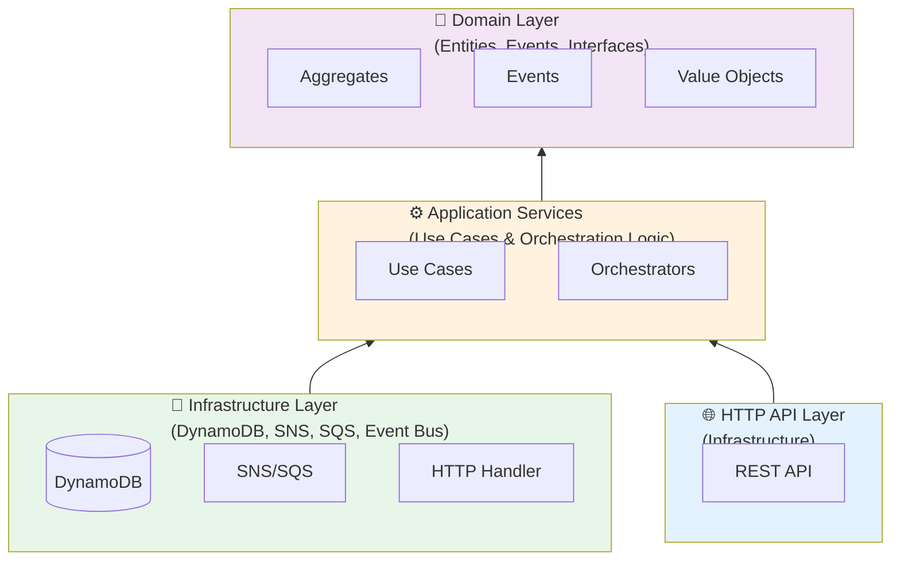
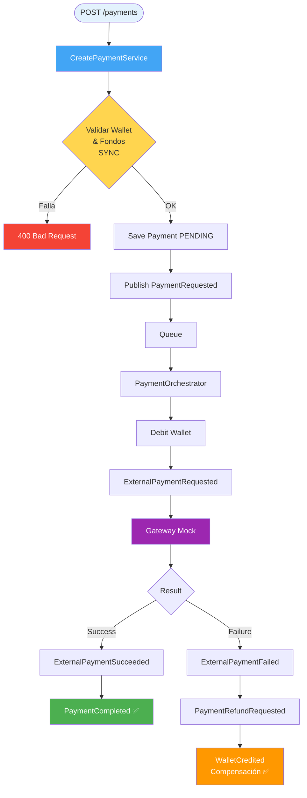

# Payment API - Sistema de Pagos Orientado a Eventos

Sistema de pagos event-driven construido con Go, arquitectura hexagonal y servicios AWS (DynamoDB, SNS, SQS) sobre LocalStack.

## 📋 Tabla de Contenidos

- [Características](#-características)
- [Documentación de Arquitectura](#-documentación-de-arquitectura)
- [Arquitectura](#️-arquitectura)
- [Requisitos](#-requisitos)
- [Instalación](#-instalación)
- [Configuración](#️-configuración)
- [Uso](#-uso)
- [Testing](#-testing)
- [Estructura del Proyecto](#-estructura-del-proyecto)
- [Flujo de Eventos](#-flujo-de-eventos)
- [API Reference](#-api-reference)
- [Comandos Make](#️-comandos-make)
- [Debugging](#-debugging)
- [Principios de Diseño](#-principios-de-diseño)
- [Dead Letter Queue (DLQ)](#-dead-letter-queue-dlq)
- [Limitaciones Conocidas](#-limitaciones-conocidas)
- [Posibles Mejoras Futuras](#-posibles-mejoras-futuras)

## ✨ Características

- **Event-Driven Architecture**: Sistema completamente orientado a eventos usando SNS/SQS
- **Clean Architecture**: Implementación hexagonal con separación clara de capas
- **Idempotencia**: Prevención de pagos duplicados mediante claves de idempotencia
- **Wallet Management**: Gestión de billeteras con validación de saldos
- **Event Sourcing**: Almacenamiento inmutable de todos los eventos del dominio
- **Compensación Automática**: Refund automático en caso de fallos
- **Observabilidad**: Mock de New Relic para tracking de eventos
- **LocalStack**: Desarrollo y testing local sin AWS real

## 📚 Documentación de Arquitectura

Ver carpeta [`/docs`](./docs/) para:

- **[Arquitectura](./docs/01-arquitectura.md)** - Componentes y flujos principales
- **[Eventos](./docs/02-eventos.md)** - Catálogo de eventos
- **[Manejo de Errores](./docs/03-manejo-errores.md)** - Retry, DLQ y compensación
- **[Diagramas](./docs/diagramas.md)** - Flujos visuales

## 🏗️ Arquitectura

### Clean Architecture / Hexagonal



### Flujo de Eventos



## 📦 Requisitos

- **Go** 1.21 o superior
- **Docker** y **Docker Compose**
- **Make** (opcional, para comandos simplificados)
- **AWS CLI** (para seed y debugging con LocalStack)

## 🚀 Instalación

### 1. Clonar el repositorio

```bash
git clone <repository-url>
cd payment-api
```

### 2. Instalar dependencias

```bash
go mod download
```

### 3. Levantar LocalStack

```bash
docker-compose up -d
sleep 5
```

### 4. Crear tablas y colas

```bash
make init-db
```

## ⚙️ Configuración

### Variables de Entorno

Crea un archivo `.env` basado en `.env.example`:

```bash
AWS_REGION=us-east-1
AWS_ENDPOINT=http://localhost:4566
USE_LOCALSTACK=true
PAYMENTS_TOPIC_ARN=arn:aws:sns:us-east-1:000000000000:payments-events
WALLET_QUEUE_URL=http://localhost:4566/000000000000/wallet-service-queue
PAYMENT_QUEUE_URL=http://localhost:4566/000000000000/payment-service-queue
EXTERNAL_GATEWAY_QUEUE_URL=http://localhost:4566/000000000000/external-gateway-queue
PORT=8080
```

### Seed de Datos

Para crear wallets de prueba:

```bash
make seed
```

Esto crea:
- `user-123`: Balance de 1000.00 ARS
- `user-456`: Balance de 50.00 ARS (para probar fondos insuficientes)

## 💻 Uso

### Iniciar la API

```bash
make run
```

O directamente:

```bash
go run cmd/api/main.go
```

La API estará disponible en `http://localhost:8080`

### Crear un Pago

```bash
curl -X POST http://localhost:8080/payments \
  -H "Content-Type: application/json" \
  -d '{
    "userId": "user-123",
    "amount": 100.50,
    "currency": "ARS",
    "serviceId": "service-123",
    "idempotencyKey": "unique-key-12345",
    "clientId": "web-app"
  }'
```

**Respuesta exitosa (nuevo pago):**

```json
{
  "paymentId": "550e8400-e29b-41d4-a716-446655440000",
  "status": "PENDING"
}
```

**Respuesta idempotente (clave repetida):**

```json
{
  "paymentId": "550e8400-e29b-41d4-a716-446655440000",
  "status": "ALREADY_PROCESSED"
}
```

### Health Check

```bash
curl http://localhost:8080/health
```

## 🧪 Testing

### Tests Unitarios

```bash
make test-unit
```

O directamente:

```bash
go test -v ./tests/unit/...
```

Los tests unitarios usan **fakes** en lugar de mocks, sin dependencias externas.

**Casos cubiertos:**
- ✅ Creación de pagos (happy path)
- ✅ Validación de requests
- ✅ Idempotencia
- ✅ Fondos insuficientes
- ✅ Debitar wallet
- ✅ Pago externo exitoso
- ✅ Flujo de refund

### Tests de Integración

Primero levanta LocalStack y la API:

```bash
make localstack-up
make run  # En otra terminal
```

Luego ejecuta:

```bash
RUN_INTEGRATION_TESTS=true make test-integration
```

Los tests de integración validan:
- ✅ Conexión con DynamoDB
- ✅ Publicación/consumo de eventos SNS/SQS
- ✅ Flujo end-to-end completo

## 📁 Estructura del Proyecto

```
payment-api/
├── cmd/
│   └── api/
│       └── main.go                    # Entry point
├── internal/
│   ├── domain/                        # Capa de dominio
│   │   ├── payment/
│   │   │   ├── aggregate.go          # Payment aggregate
│   │   │   ├── payment_processor.go  # Domain service
│   │   │   ├── payment_requested_event.go
│   │   │   ├── payment_completed_event.go
│   │   │   ├── payment_failed_event.go
│   │   │   ├── payment_refund_requested_event.go
│   │   │   ├── external_payment_requested_event.go
│   │   │   ├── external_payment_succeeded_event.go
│   │   │   ├── external_payment_failed_event.go
│   │   │   └── external_payment_timeout_event.go
│   │   ├── wallet/
│   │   │   ├── aggregate.go          # Wallet aggregate
│   │   │   ├── wallet_service.go     # Domain service
│   │   │   ├── wallet_debited_event.go
│   │   │   └── wallet_credited_event.go
│   │   └── shared/
│   │       ├── event.go              # Event interface
│   │       ├── repositories.go       # Repository interfaces
│   │       ├── errors/
│   │       │   └── errors.go         # Domain errors
│   │       └── valueobjects/
│   │           ├── currency.go
│   │           ├── identifiers.go
│   │           ├── money.go
│   │           └── payment_status.go
│   ├── application/                   # Capa de aplicación
│   │   ├── command/
│   │   │   └── create_payment.go     # Create payment use case
│   │   ├── orchestrator/
│   │   │   ├── payment_orchestrator.go
│   │   │   ├── external_gateway_mock.go
│   │   │   └── event_parser.go
│   │   └── port/
│   │       └── event_bus.go          # Port interfaces
│   ├── infrastructure/                # Capa de infraestructura
│   │   ├── aws_config.go
│   │   ├── localstack_setup.go
│   │   ├── http/
│   │   │   └── handler.go
│   │   ├── messaging/
│   │   │   ├── sns/
│   │   │   │   └── publisher.go
│   │   │   └── sqs/
│   │   │       └── consumer.go
│   │   └── persistence/
│   │       └── dynamodb/
│   │           ├── payment_repository.go
│   │           ├── wallet_repository.go
│   │           ├── event_store.go
│   │           ├── idempotency_store.go
│   │           └── mappers/
│   │               ├── payment_mapper.go
│   │               └── wallet_mapper.go
│   └── observability/
│       └── newrelic_mock.go
├── tests/
│   ├── unit/
│   │   ├── create_payment_test.go
│   │   ├── payment_orchestrator_test.go
│   │   └── fakes/
│   │       ├── payment_repository_fake.go
│   │       ├── wallet_repository_fake.go
│   │       ├── idempotency_store_fake.go
│   │       ├── event_store_fake.go
│   │       └── event_publisher_fake.go
│   └── integration/
│       └── payment_flow_test.go
├── scripts/
│   ├── init_tables.go                # Inicializa DynamoDB
│   └── seed_data.sh                  # Seed de datos
├── docs/                              # Documentación
│   ├── 01-arquitectura.md
│   ├── 02-eventos.md
│   ├── 03-manejo-errores.md
│   ├── diagramas.md
│   ├── faq.md
│   └── README.md
├── docker-compose.yml
├── Makefile
├── go.mod
├── go.sum
└── README.md
```

## 🔄 Flujo de Eventos

### 1. PaymentRequested

Emitido cuando se crea un nuevo pago (después de validación síncrona).

**Handler:** `PaymentOrchestrator.HandlePaymentRequested`

**Lógica:**
- Debita wallet
- Emite `WalletDebited` y `ExternalPaymentRequested`

**Nota:** La validación de wallet y fondos se hace ANTES en `CreatePaymentService` (síncrono).

### 2. WalletDebited

Emitido cuando se debita una wallet.

**Metadata incluida:**
- Balance anterior
- Balance nuevo
- Monto debitado

### 3. ExternalPaymentRequested

Emitido para solicitar procesamiento por gateway externo.

**Handler:** `ExternalGatewayMock.HandleExternalPaymentRequested`

**Lógica:**
- Simula procesamiento externo
- Emite `ExternalPaymentSucceeded` o `ExternalPaymentFailed`

### 4. ExternalPaymentSucceeded

Emitido cuando el gateway confirma el pago.

**Handler:** `PaymentOrchestrator.HandleExternalPaymentSucceeded`

**Lógica:**
- Marca payment como `COMPLETED`
- Emite `PaymentCompleted`

### 5. ExternalPaymentFailed / ExternalPaymentTimeout

Emitido cuando el gateway rechaza o timeout.

**Handler:** `PaymentOrchestrator.HandleExternalPaymentFailed`

**Lógica:**
- Marca payment como `FAILED`
- Emite `PaymentRefundRequested`

### 6. PaymentRefundRequested

Emitido para compensar un pago fallido.

**Handler:** `PaymentOrchestrator.HandlePaymentRefundRequested`

**Lógica:**
- Acredita monto al wallet
- Emite `WalletCredited`

### 7. WalletCredited

Emitido cuando se acredita una wallet (refund).

## 📚 API Reference

### POST /payments

Crea un nuevo pago.

**Request Body:**

```json
{
  "userId": "string (required)",
  "amount": "number (required, > 0)",
  "currency": "string (required)",
  "serviceId": "string (required)",
  "idempotencyKey": "string (required, unique)",
  "clientId": "string (optional)"
}
```

**Responses:**

- **200 OK**: Pago creado o ya existente
- **400 Bad Request**: Validación fallida
- **500 Internal Server Error**: Error del servidor

### GET /health

Health check del servicio.

**Response:**

```
OK
```

## 🛠️ Comandos Make

```bash
make help              # Muestra todos los comandos disponibles
make build             # Compila el binario
make run               # Ejecuta la aplicación
make localstack-up     # Levanta LocalStack
make localstack-down   # Detiene LocalStack
make init-db           # Crea tablas y colas (ejecutar después de localstack-up)
make seed              # Seed de datos iniciales (ejecutar después de init-db)
make test              # Ejecuta todos los tests
make test-unit         # Ejecuta tests unitarios
make test-integration  # Ejecuta tests de integración
make clean             # Limpia artifacts
make dev               # Setup completo (localstack + init-db + seed)
```

## 🔍 Debugging

### Ver colas SQS

```bash
aws sqs list-queues \
  --endpoint-url http://localhost:4566 \
  --region us-east-1 \
  --no-sign-request
```

### Ver mensajes en cola

```bash
aws sqs receive-message \
  --queue-url http://localhost:4566/000000000000/payment-service-queue \
  --endpoint-url http://localhost:4566 \
  --region us-east-1 \
  --no-sign-request
```

### Ver tabla DynamoDB

```bash
aws dynamodb scan \
  --table-name Payments \
  --endpoint-url http://localhost:4566 \
  --region us-east-1 \
  --no-sign-request
```

### Ver eventos en EventStore

```bash
aws dynamodb query \
  --table-name EventStore \
  --key-condition-expression "paymentId = :pid" \
  --expression-attribute-values '{":pid": {"S": "tu-payment-id"}}' \
  --endpoint-url http://localhost:4566 \
  --region us-east-1 \
  --no-sign-request
```

## 📝 Principios de Diseño

### Inmutabilidad

- Eventos con campos privados + getters
- Sin setters en eventos
- Repositorios retornan copias

### Idempotencia

Garantizada mediante:
- `IdempotencyStore` con DynamoDB
- Check antes de procesar
- Same response para requests duplicados

## 🔄 Dead Letter Queue (DLQ)

Cada cola tiene una **DLQ asociada** con redrive policy automática:
- Después de **3 intentos fallidos**, SQS mueve automáticamente el mensaje a la DLQ
- Visibility timeout: 30 segundos por intento
- Retención: 14 días en DLQ, 1 día en cola principal

---

## 🚧 Limitaciones Conocidas

- **No incluye autenticación/autorización** (fuera de scope)
- **Gateway mock siempre exitoso** (configurable con `alwaysSuccess`)
- **Sin circuit breaker** para servicios externos
- **Sin retry con exponential backoff** (usa redrive policy de SQS)
- **Sin monitor activo de DLQ** (se puede revisar crear alertas en NewRelic)
- **Observabilidad mockeada** (logs en consola)

## 🔮 Posibles Mejoras Futuras

- [x] **Dead Letter Queues (DLQ)** ✅ Implementado
- [ ] Monitor activo de DLQ con alertas
- [ ] Circuit breaker con patron de resiliencia
- [ ] Retry con exponential backoff personalizado
- [ ] Webhooks para notificaciones
- [ ] API versioning
- [ ] GraphQL endpoint
- [ ] Paginación en queries
- [ ] Compresión de eventos antiguos
