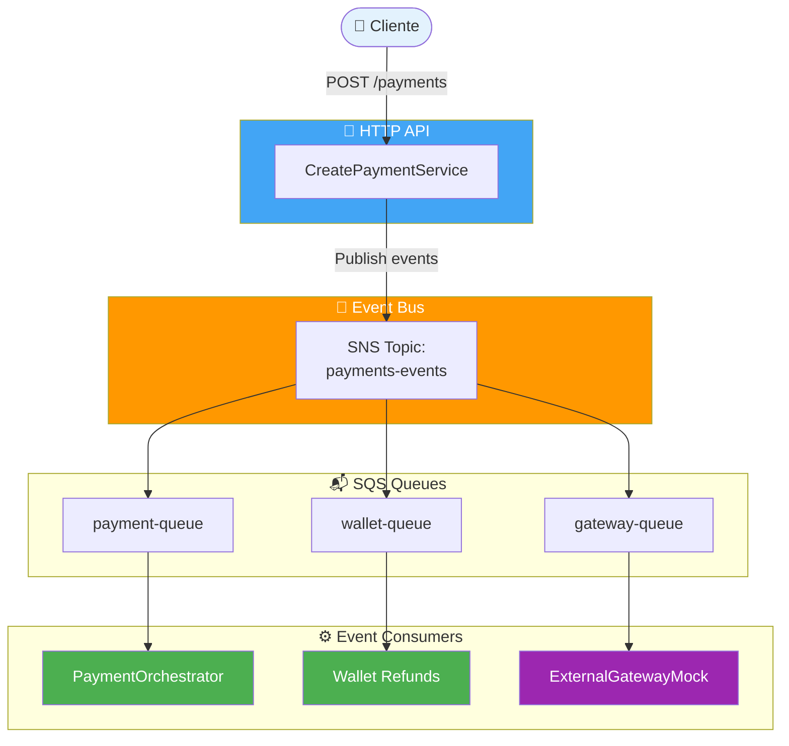
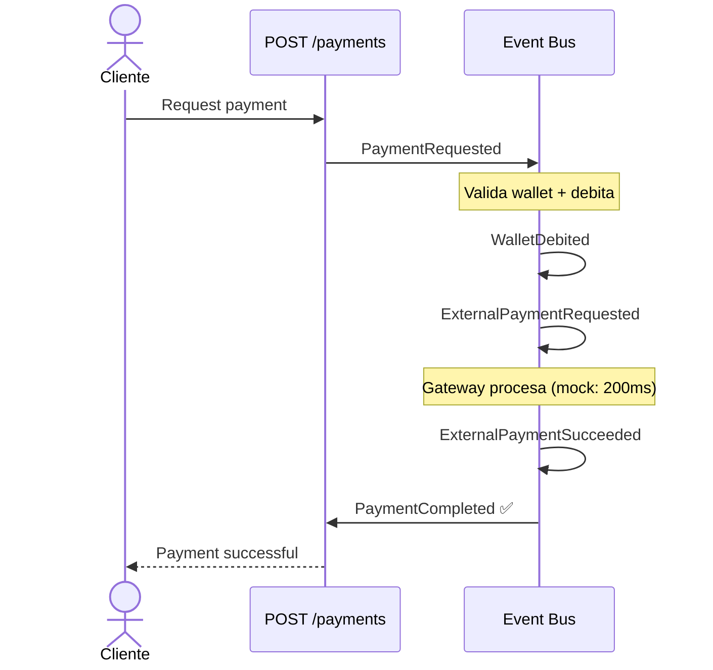
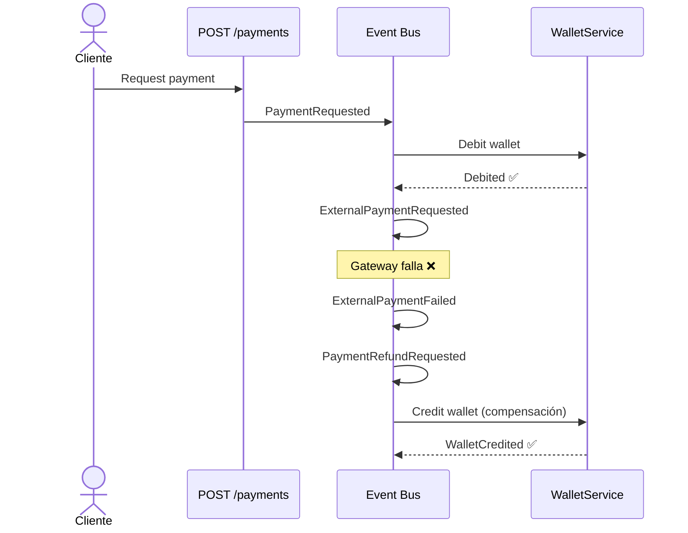
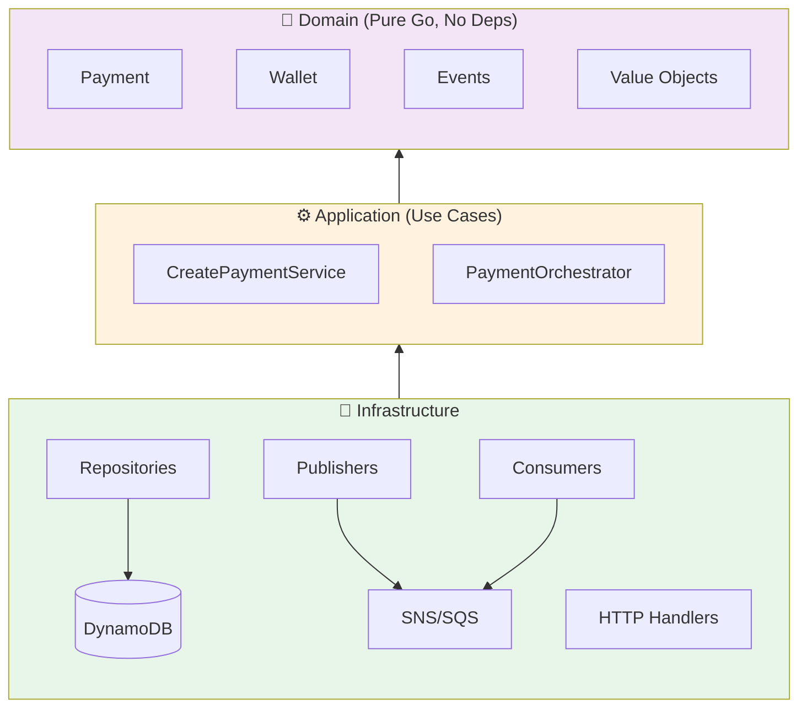

# Arquitectura del Sistema

## Visión General

Sistema de pagos event-driven con Go. La idea: separar responsabilidades con arquitectura hexagonal y que todo fluya mediante eventos.

## Componentes

**Tablas DynamoDB:**
- `Payments`: Estado de pagos
- `Wallets`: Balances de usuarios
- `EventStore`: Historial de eventos (event sourcing)
- `Idempotency`: Prevenir duplicados

**Colas SQS:**
- Cada una con su DLQ (3 reintentos)
- Visibility timeout: 30s

## Flujo Principal

**Happy Path:**

**Con Fallo del Gateway:**

## Capas

**Domain:** Payment, Wallet, Events, Value Objects
**Application:** CreatePaymentService, PaymentOrchestrator
**Infrastructure:** Repositories, Publishers, Consumers, HTTP handlers

## Decisiones Clave

**¿Por qué monolito con colas?**
- Simple de deployar y desarrollar
- Las colas ya separan concerns para futura migración

**¿Por qué DynamoDB?**
- Compatible con LocalStack
- Event sourcing friendly
- Sin migrations

**¿Por qué SNS+SQS?**
- Desacoplamiento total
- Retry automático con DLQ
- Fan-out gratis

## Event Sourcing

Todos los eventos se guardan en `EventStore` antes de publicarse:
- Auditoría completa
- Replay posible
- Debugging temporal
