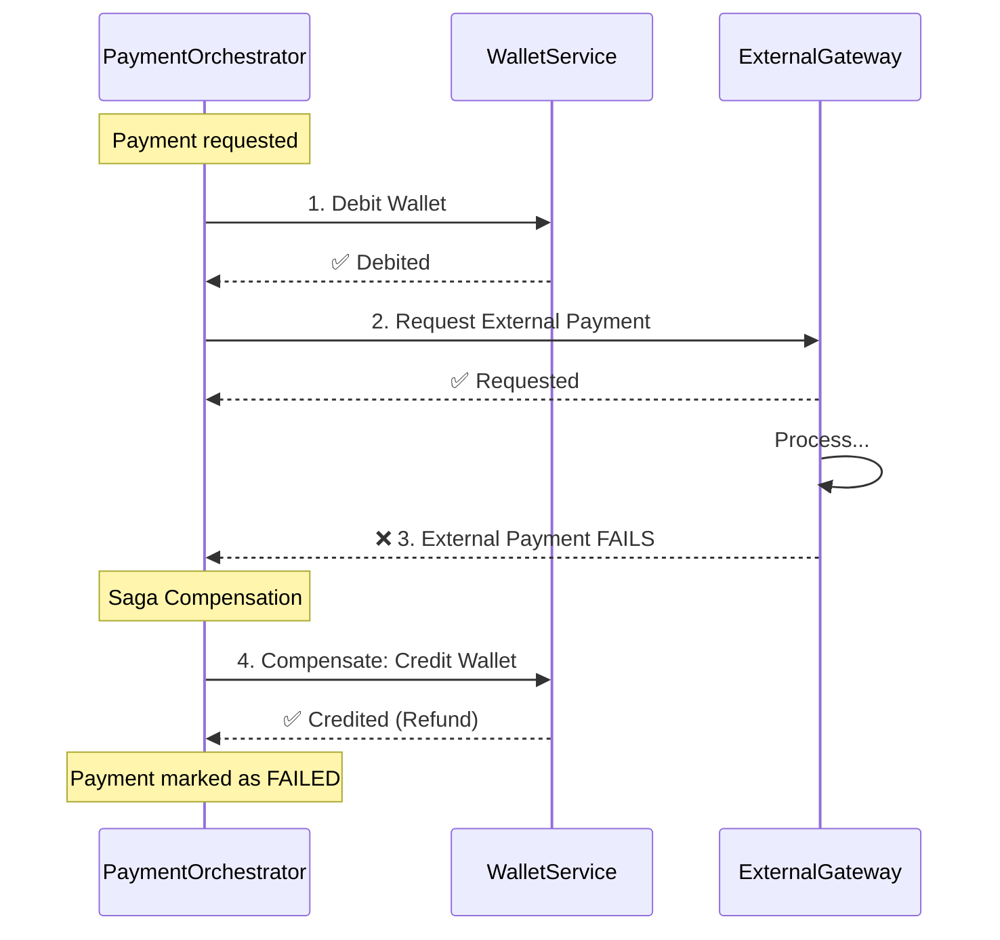

# Manejo de Errores

## Escenarios de Falla

### 1. Request Duplicado
**Detección:** `idempotencyKey` ya existe  
**Acción:** Retornar resultado anterior  
**Compensación:** Ninguna  

### 2. Wallet No Existe
**Detección:** CreatePaymentService valida síncronamente (línea 94-96)  
**Acción:** Retorna `400 Bad Request` con error `WALLET_NOT_FOUND`  
**Compensación:** Ninguna (el payment nunca se crea)  

### 3. Fondos Insuficientes
**Detección:** CreatePaymentService valida balance síncronamente  
**Acción:** Retorna `400 Bad Request` con error `INSUFFICIENT_FUNDS`  
**Compensación:** Ninguna (el payment nunca se crea)  

**Nota:** Ambos errores se detectan ANTES de guardar el payment en DB y ANTES de publicar eventos.  

### 4. Gateway Falla
**Detección:** `ExternalPaymentFailed`  
**Acción:** Saga de compensación  
**Compensación:** Refund automático via `PaymentRefundRequested` → `WalletCredited`  

### 5. Error de DB
**Detección:** DynamoDB error  
**Acción:** SQS retry (no deletear mensaje)  
**Compensación:** Automática (retry) o manual (DLQ)  

### 6. Error al Publicar
**Detección:** SNS error  
**Acción:** SQS retry  
**Nota:** Evento ya guardado en EventStore, puede republicarse  

## Retry Policy

**SQS Config:**
- `maxReceiveCount: 3`
- `visibilityTimeout: 30s`
- Total retry window: ~90s

Después de 3 intentos → DLQ

## Dead Letter Queue (DLQ)

Cada cola tiene su DLQ:
- `payment-service-queue-dlq`
- `wallet-service-queue-dlq`
- `external-gateway-queue-dlq`

**Qué va a DLQ:**
- Mensajes que fallaron 3 veces
- Bugs en el código
- Datos corruptos

**Recovery:**
```bash
# Ver mensajes
aws sqs receive-message \
  --queue-url http://localhost:4566/.../payment-service-queue-dlq

# Republicar si el bug está fixeado
```

## Saga Pattern

**Compensación automática:**



El `PaymentOrchestrator` coordina la Saga.

## Idempotencia

```go
// Antes de procesar
existing := idempotencyStore.Get(idempotencyKey)
if existing != nil {
    return existing // safe to retry
}

// Procesar...
idempotencyStore.Save(idempotencyKey, result)
```

Cada handler debe ser idempotente. Validamos estado en DB antes de procesar.

## Validación

**Input validation:**
- Required fields
- Amount > 0
- Valid currency
- IdempotencyKey presente

**Event parsing:**
```go
event, ok := rawEvent.(*PaymentRequestedEvent)
if !ok {
    log error, skip mensaje
}
```
