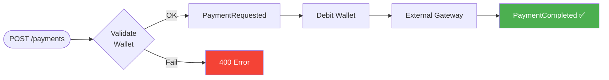
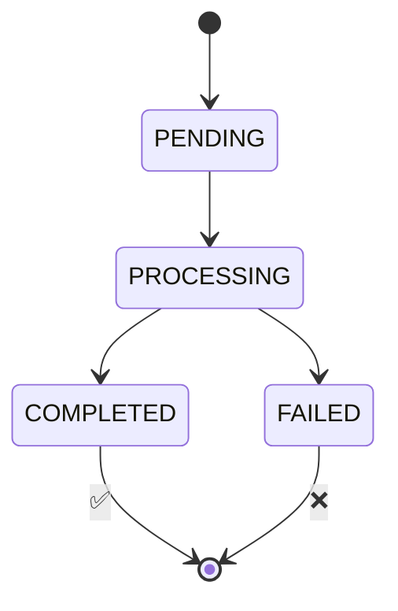

# Documentación de Arquitectura

Documentación técnica del sistema de pagos event-driven.

## Documentos

- **[Arquitectura](./01-arquitectura.md)** - Componentes y flujos principales
- **[Eventos](./02-eventos.md)** - Catálogo de eventos
- **[Manejo de Errores](./03-manejo-errores.md)** - Retry, DLQ y compensación
- **[Diagramas](./diagramas.md)** - Flujos visuales
- **[FAQ](./faq.md)** - Preguntas frecuentes

## Quick Reference

**Flujo Happy Path:**

**Flujo con Fallo:**

**Estados de Payment:**

**Garantías:**
- ✅ Idempotencia (safe to retry)
- ✅ Compensación automática (Saga)
- ✅ Event sourcing (auditoría completa)
- ✅ At-least-once delivery
- ❌ FIFO ordering (mitigado con estado en DB)

## Stack

- **Go** 1.21+
- **DynamoDB** (4 tablas)
- **SNS** (1 topic)
- **SQS** (3 queues + 3 DLQs)
- **LocalStack** (desarrollo)
