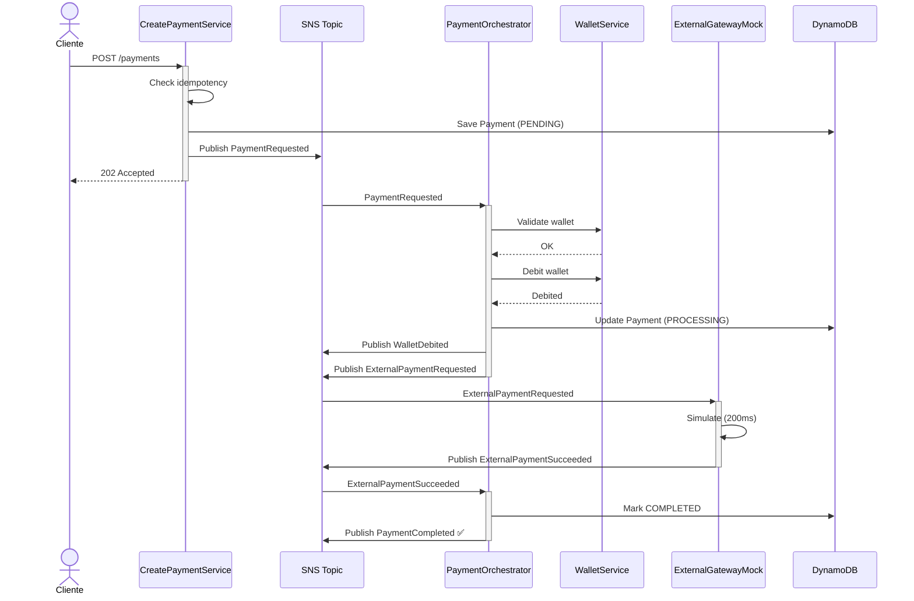
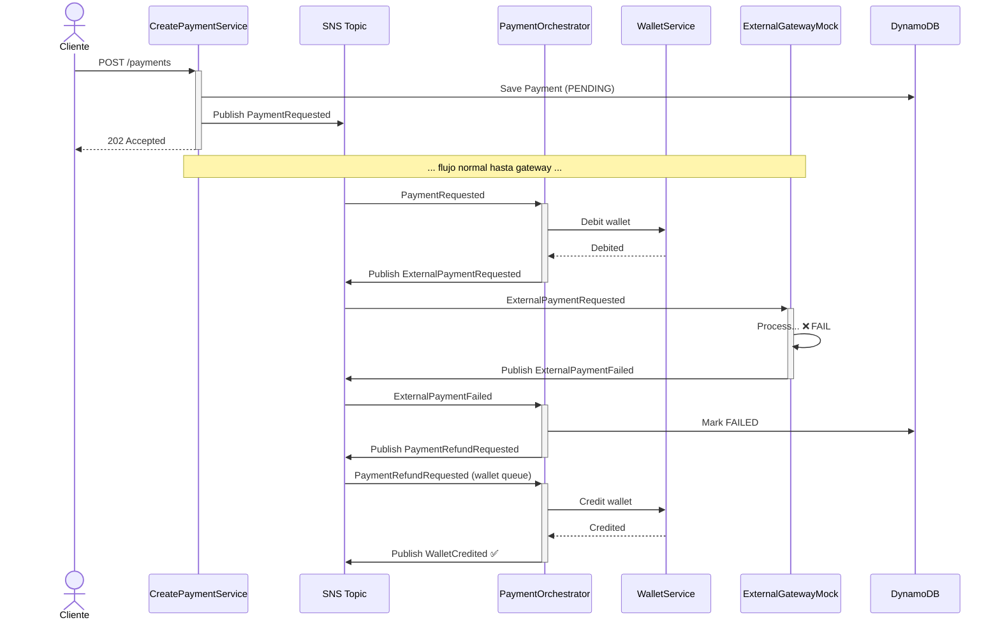
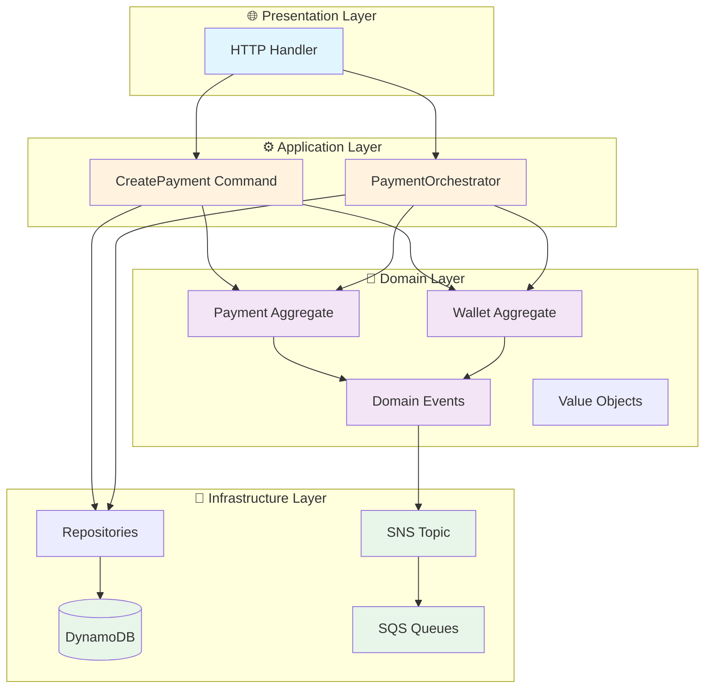
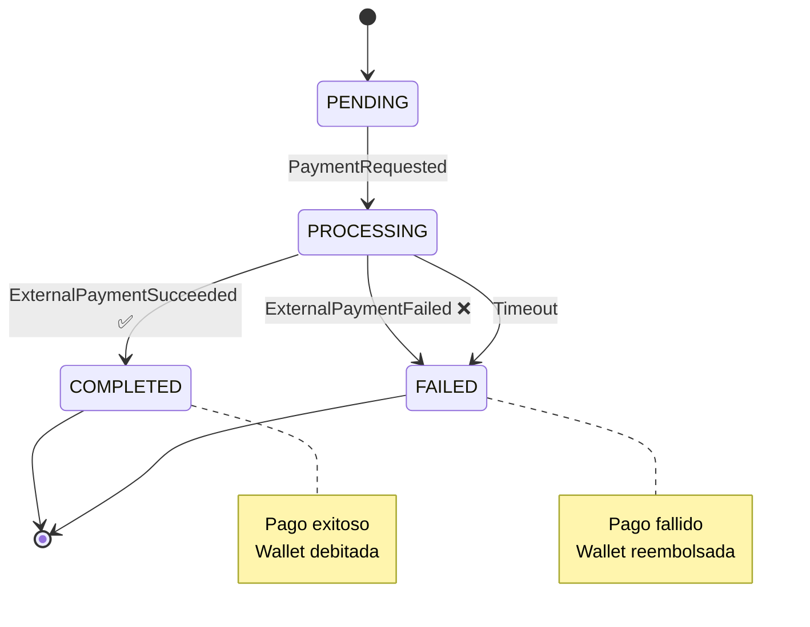
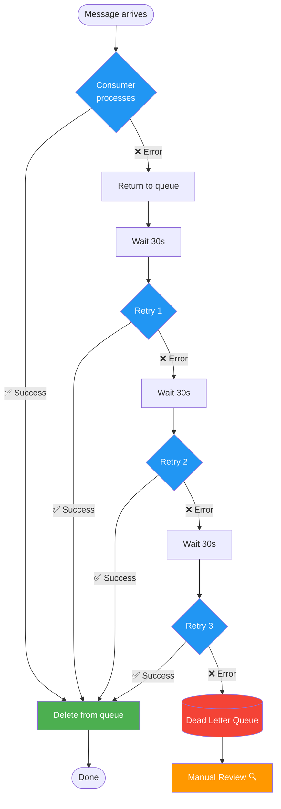
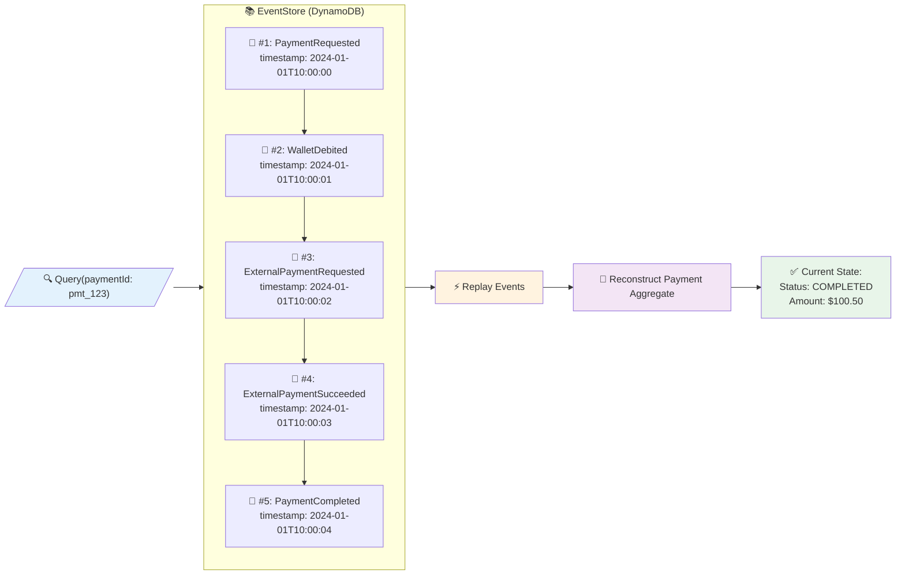
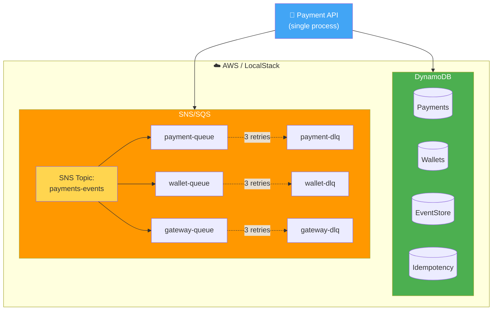

# Diagramas

## Flujo Happy Path

```mermaid
sequenceDiagram
    actor Cliente
    participant API as CreatePaymentService
    participant SNS as SNS Topic
    participant PO as PaymentOrchestrator
    participant Wallet as WalletService
    participant Gateway as ExternalGatewayMock
    participant DB as DynamoDB

    Cliente->>+API: POST /payments
    API->>API: Check idempotency
    API->>DB: Save Payment (PENDING)
    API->>SNS: Publish PaymentRequested
    API-->>-Cliente: 202 Accepted
    
    SNS->>+PO: PaymentRequested
    PO->>Wallet: Validate wallet
    Wallet-->>PO: OK
    PO->>Wallet: Debit wallet
    Wallet-->>PO: Debited
    PO->>DB: Update Payment (PROCESSING)
    PO->>SNS: Publish WalletDebited
    PO->>SNS: Publish ExternalPaymentRequested
    deactivate PO
    
    SNS->>+Gateway: ExternalPaymentRequested
    Gateway->>Gateway: Simulate (200ms)
    Gateway->>SNS: Publish ExternalPaymentSucceeded
    deactivate Gateway
    
    SNS->>+PO: ExternalPaymentSucceeded
    PO->>DB: Mark COMPLETED
    PO->>SNS: Publish PaymentCompleted ✅
    deactivate PO
```

## Flujo con Refund

```mermaid
sequenceDiagram
    actor Cliente
    participant API as CreatePaymentService
    participant SNS as SNS Topic
    participant PO as PaymentOrchestrator
    participant Wallet as WalletService
    participant Gateway as ExternalGatewayMock
    participant DB as DynamoDB

    Cliente->>+API: POST /payments
    API->>DB: Save Payment (PENDING)
    API->>SNS: Publish PaymentRequested
    API-->>-Cliente: 202 Accepted
    
    Note over API,Gateway: ... flujo normal hasta gateway ...
    
    SNS->>+PO: PaymentRequested
    PO->>Wallet: Debit wallet
    Wallet-->>PO: Debited
    PO->>SNS: Publish ExternalPaymentRequested
    deactivate PO
    
    SNS->>+Gateway: ExternalPaymentRequested
    Gateway->>Gateway: Process... ❌ FAIL
    Gateway->>SNS: Publish ExternalPaymentFailed
    deactivate Gateway
    
    SNS->>+PO: ExternalPaymentFailed
    PO->>DB: Mark FAILED
    PO->>SNS: Publish PaymentRefundRequested
    deactivate PO
    
    SNS->>+PO: PaymentRefundRequested (wallet queue)
    PO->>Wallet: Credit wallet
    Wallet-->>PO: Credited
    PO->>SNS: Publish WalletCredited ✅
    deactivate PO
```

## Arquitectura de Capas

```mermaid
graph TD
    subgraph "🌐 Presentation Layer"
        HTTP[HTTP Handler]
    end
    
    subgraph "⚙️ Application Layer"
        CMD[CreatePayment Command]
        ORCH[PaymentOrchestrator]
    end
    
    subgraph "🎯 Domain Layer"
        PAY[Payment Aggregate]
        WALL[Wallet Aggregate]
        EVT[Domain Events]
        VO[Value Objects]
    end
    
    subgraph "🔧 Infrastructure Layer"
        DB[(DynamoDB)]
        SNS[SNS Topic]
        SQS[SQS Queues]
        REPO[Repositories]
    end
    
    HTTP --> CMD
    HTTP --> ORCH
    CMD --> PAY
    CMD --> WALL
    ORCH --> PAY
    ORCH --> WALL
    PAY --> EVT
    WALL --> EVT
    CMD --> REPO
    ORCH --> REPO
    REPO --> DB
    EVT --> SNS
    SNS --> SQS
    
    style HTTP fill:#e1f5ff
    style CMD fill:#fff3e0
    style ORCH fill:#fff3e0
    style PAY fill:#f3e5f5
    style WALL fill:#f3e5f5
    style EVT fill:#f3e5f5
    style DB fill:#e8f5e9
    style SNS fill:#e8f5e9
    style SQS fill:#e8f5e9
```

## Estados de Payment

```mermaid
stateDiagram-v2
    [*] --> PENDING
    PENDING --> PROCESSING: PaymentRequested
    PROCESSING --> COMPLETED: ExternalPaymentSucceeded ✅
    PROCESSING --> FAILED: ExternalPaymentFailed ❌
    PROCESSING --> FAILED: Timeout
    COMPLETED --> [*]
    FAILED --> [*]
    
    note right of COMPLETED
        Pago exitoso
        Wallet debitada
    end note
    
    note right of FAILED
        Pago fallido
        Wallet reembolsada
    end note
```

## SQS Retry Flow

```mermaid
flowchart TD
    Start([Message arrives]) --> Consumer{Consumer<br/>processes}
    
    Consumer -->|✅ Success| Delete[Delete from queue]
    Consumer -->|❌ Error| Return[Return to queue]
    Delete --> End([Done])
    
    Return --> Wait1[Wait 30s]
    Wait1 --> Retry1{Retry 1}
    Retry1 -->|✅ Success| Delete
    Retry1 -->|❌ Error| Wait2[Wait 30s]
    
    Wait2 --> Retry2{Retry 2}
    Retry2 -->|✅ Success| Delete
    Retry2 -->|❌ Error| Wait3[Wait 30s]
    
    Wait3 --> Retry3{Retry 3}
    Retry3 -->|✅ Success| Delete
    Retry3 -->|❌ Error| DLQ[(Dead Letter Queue)]
    
    DLQ --> Manual[Manual Review 🔍]
    
    style Delete fill:#4caf50,color:#fff
    style DLQ fill:#f44336,color:#fff
    style Manual fill:#ff9800,color:#fff
    style Consumer fill:#2196f3,color:#fff
    style Retry1 fill:#2196f3,color:#fff
    style Retry2 fill:#2196f3,color:#fff
    style Retry3 fill:#2196f3,color:#fff
```

## Event Sourcing

```mermaid
flowchart LR
    subgraph EventStore["📚 EventStore (DynamoDB)"]
        direction TB
        E1["🔵 #1: PaymentRequested<br/>timestamp: 2024-01-01T10:00:00"]
        E2["🔵 #2: WalletDebited<br/>timestamp: 2024-01-01T10:00:01"]
        E3["🔵 #3: ExternalPaymentRequested<br/>timestamp: 2024-01-01T10:00:02"]
        E4["🔵 #4: ExternalPaymentSucceeded<br/>timestamp: 2024-01-01T10:00:03"]
        E5["🔵 #5: PaymentCompleted<br/>timestamp: 2024-01-01T10:00:04"]
        E1 --> E2 --> E3 --> E4 --> E5
    end
    
    Query[/"🔍 Query(paymentId: pmt_123)"/] --> EventStore
    EventStore --> Replay["⚡ Replay Events"]
    Replay --> Reconstruct["🔄 Reconstruct Payment Aggregate"]
    Reconstruct --> State["✅ Current State:<br/>Status: COMPLETED<br/>Amount: $100.50"]
    
    style Query fill:#e3f2fd
    style Replay fill:#fff3e0
    style Reconstruct fill:#f3e5f5
    style State fill:#e8f5e9
```

## Componentes

```mermaid
graph TD
    API["🚀 Payment API<br/>(single process)"]
    
    subgraph AWS["☁️ AWS / LocalStack"]
        direction TB
        subgraph DDB["DynamoDB"]
            T1[(Payments)]
            T2[(Wallets)]
            T3[(EventStore)]
            T4[(Idempotency)]
        end
        
        subgraph Messaging["SNS/SQS"]
            SNS[SNS Topic:<br/>payments-events]
            Q1[payment-queue]
            Q2[wallet-queue]
            Q3[gateway-queue]
            DLQ1[payment-dlq]
            DLQ2[wallet-dlq]
            DLQ3[gateway-dlq]
        end
    end
    
    API --> DDB
    API --> Messaging
    SNS --> Q1
    SNS --> Q2
    SNS --> Q3
    Q1 -.->|3 retries| DLQ1
    Q2 -.->|3 retries| DLQ2
    Q3 -.->|3 retries| DLQ3
    
    style API fill:#42a5f5,color:#fff
    style DDB fill:#4caf50,color:#fff
    style Messaging fill:#ff9800,color:#fff
    style SNS fill:#ffd54f
```
